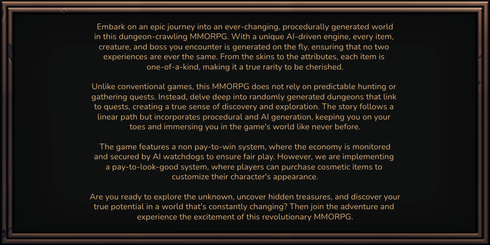

  

<!--
Embark on an epic journey into an ever-changing, procedurally generated world in this dungeon-crawling MMORPG. With a unique AI-driven engine, every item, creature, and boss you encounter is generated on the fly, ensuring that no two experiences are ever the same. From the skins to the attributes, each item is one-of-a-kind, making it a true rarity to be cherished.

Unlike conventional games, this MMORPG does not rely on predictable hunting or gathering quests. Instead, delve deep into randomly generated dungeons that link to quests, creating a true sense of discovery and exploration. The story follows a linear path but incorporates procedural and AI generation, keeping you on your toes and immersing you in the game's world like never before.

The game features a non pay-to-win system, where the economy is monitored and secured by AI watchdogs to ensure fair play. However, we are implementing a pay-to-look-good system, where players can purchase cosmetic items to customize their character's appearance.

Are you ready to explore the unknown, uncover hidden treasures, and discover your true potential in a world that's constantly changing? Then join the adventure and experience the excitement of this revolutionary MMORPG.

-->

💬 [Discussions](https://github.com/orgs/EndlessHalls/discussions) \
👾 [Discord](https://endlesshalls.com/discord) \
🐦 [Twitter](https://twitter.com/endless_halls)
